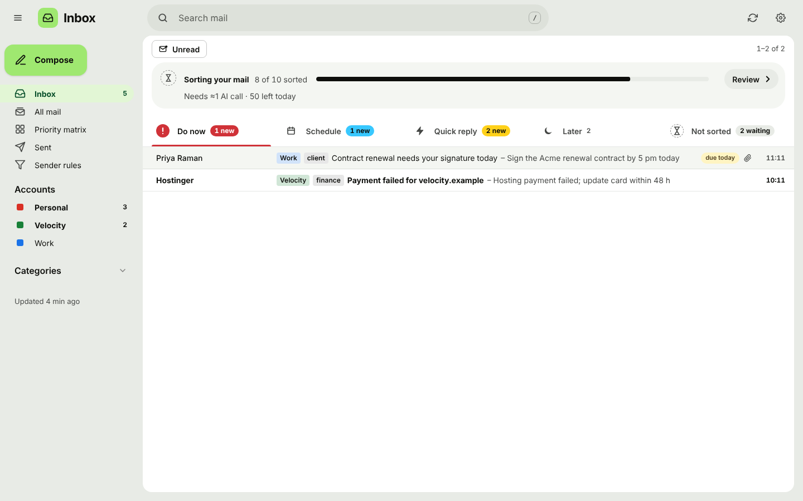

# Dashboard for all Gmails

One place for every Gmail and hosting mailbox, sorted by importance and urgency with
Gemma (via OpenRouter). Runs on your own computer; the only possible cost is OpenRouter
(free Gemma first, paid Gemma as a fallback, capped per day). Full plan: [PLAN.md](PLAN.md).



## Setup on a Mac (once)

Open **Terminal** (Cmd+Space, type "Terminal").

1. Get Python 3.11+ (macOS's built-in `python3` is 3.9, which is too old):
   ```
   brew install python@3.14
   python3.14 --version
   ```
2. Download the code and create the environment **with python3.14**:
   ```
   cd ~/Documents
   git clone https://github.com/cube-vg/dashboard-for-all-gmails.git
   cd dashboard-for-all-gmails
   git checkout claude/dreamy-wright-isuy3u
   python3.14 -m venv .venv
   source .venv/bin/activate
   python --version              # must say 3.14.x
   pip install -r requirements.txt
   ```
   Inside `(.venv)`, plain `python` and `pip` are 3.14. Run `source .venv/bin/activate`
   in every new Terminal window.
3. Add your OpenRouter key: `cp .env.example .env && open -e .env`
4. List your mailboxes: `cp accounts.example.yaml accounts.yaml && open -e accounts.yaml`
   - **Gmail:** turn on 2-Step Verification, create an *App Password*
     (Google Account → Security → App passwords) and make sure IMAP is enabled.
   - **Hosting mailboxes:** host is usually `mail.yourdomain.com`, port 993.
5. Save each password once (stored in your Mac's Keychain; click **Always Allow** if asked):
   ```
   python -m app.cli set-password you@gmail.com
   ```
6. Check everything connects:
   ```
   python -m app.cli check      # logs in to every account
   python -m app.cli test-ai    # your OpenRouter key reaches Gemma
   ```

On Windows/Linux the steps are the same with `python -m venv .venv` and the
matching activate command.

## Run the dashboard

```
python -m app
```

Opens http://127.0.0.1:8000 in your browser. Next time: `cd ~/Documents/dashboard-for-all-gmails && source .venv/bin/activate && python -m app`.

On a Mac, if pop-ups don't appear, allow notifications for **Script Editor** in System Settings → Notifications. While it runs it checks mail every
5 minutes, sorts new mail, and shows a desktop pop-up for very important new mail.

| Option | What it does |
|---|---|
| `--port 8000` | use another port |
| `--no-browser` | don't open the browser automatically |
| `--window` | open in its own window instead of a browser tab (needs `pip install pywebview`) |
| `--no-scheduler` | no automatic syncing; use the **Sync now** button |

In the dashboard:
- **Matrix** view: Urgent + important / Important / Urgent / Neither. **List** view: one list by priority.
- Click a card for the full email, the AI's reason ("why?") and an **Open in Gmail** link.
- **Move to** buttons or *Fine-tune the score* correct the AI; your corrections are shown
  to Gemma as examples next time, so it learns your taste.
- *Rules for this sender*: **VIP** (always important), **Always low**, or
  **Private** (never sent to the AI). Manage them all under **Rules**.

## How sorting keeps costs at ~$0

- Newsletters (unsubscribe link), promos, OTP codes, private senders and mail older than
  7 days are scored by simple rules, with no AI call.
- The rest goes to Gemma 20 emails per request (sender, subject, first 300 characters).
- Each email is scored once. `MAX_AI_CALLS_PER_DAY` in `.env` is a hard daily cap.
- Free model rate-limited? It switches to the paid Gemma for the rest of that run.

## Command line

```
python -m app.cli sync       # fetch new mail
python -m app.cli classify   # sort unscored mail
python -m app.cli run-once   # sync + sort + notify once
python -m app.cli list       # newest mail from all accounts, with priority scores
```

## Settings (`.env`)

| Setting | Default | |
|---|---|---|
| `AI_MODEL` | `google/gemma-4-26b-a4b-it:free` | first choice |
| `AI_FALLBACK_MODEL` | `google/gemma-4-26b-a4b-it` | used when the free one is busy |
| `MAX_AI_CALLS_PER_DAY` | `50` | hard cap on AI requests |
| `SYNC_DAYS_BACK` / `MAX_INITIAL_MESSAGES` | `14` / `300` | how much old mail the first sync fetches |
| `SYNC_INTERVAL_MINUTES` | `5` | how often `python -m app` checks mail |
| `NOTIFICATIONS` / `NOTIFY_THRESHOLD` | `1` / `4.5` | desktop pop-ups and how important mail must be |

## Privacy

- Everything is stored in `data/inbox.db` on your computer; the server only listens on 127.0.0.1.
- Mail is never marked read, moved or deleted on the server.
- Only sender, subject and ~300 characters of mail that passes the rules go to OpenRouter.
  Turn off prompt logging in your OpenRouter privacy settings, and mark sensitive senders
  (bank, doctor) as **Private**.

## Tests

```
python -m pytest
```
