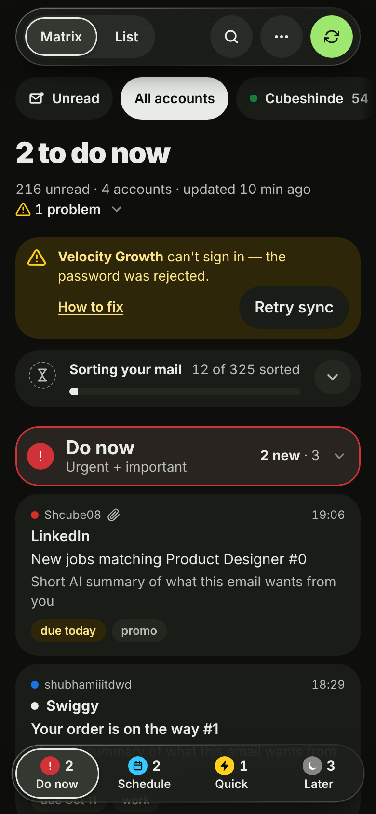

# Dashboard for all Gmails

One place for every Gmail and hosting mailbox, sorted by importance and urgency with
Gemma (via OpenRouter), that looks and works like Gmail: read, reply, forward and write
new mail from any of your addresses. Runs on your own computer (or a free cloud VM); the
only possible cost is OpenRouter (free Gemma first, paid Gemma as a fallback, capped per
day). Full plan: [PLAN.md](PLAN.md).




## Setup on a Mac (once)

Open **Terminal** (Cmd+Space, type "Terminal").

1. Get Python 3.11+ (macOS's built-in `python3` is 3.9, which is too old):
   ```
   brew install python@3.14
   python3.14 --version
   ```
2. Download the code and create the environment **with python3.14**:
   ```
   cd ~/Documents
   git clone https://github.com/cube-vg/dashboard-for-all-gmails.git
   cd dashboard-for-all-gmails
   python3.14 -m venv .venv
   source .venv/bin/activate
   python --version              # must say 3.14.x
   pip install -r requirements.txt
   ```
   Inside `(.venv)`, plain `python` and `pip` are 3.14. Run `source .venv/bin/activate`
   in every new Terminal window.
3. Add your OpenRouter key: `cp .env.example .env && open -e .env`
4. List your mailboxes: `cp accounts.example.yaml accounts.yaml && open -e accounts.yaml`
   - **Gmail:** turn on 2-Step Verification, create an *App Password*
     (Google Account → Security → App passwords) and make sure IMAP is enabled.
   - **Hosting mailboxes:** host is usually `mail.yourdomain.com`, port 993.
   - **Sending** needs nothing extra: the same password works, and the outgoing server is
     worked out from the incoming one (`imap.gmail.com` → `smtp.gmail.com`,
     `imap.hostinger.com` → `smtp.hostinger.com`, port 465). If yours differs, add
     `smtp_host:` / `smtp_port:` to that account (see accounts.example.yaml).
5. Save each password once (stored in your Mac's Keychain; click **Always Allow** if asked):
   ```
   python -m app.cli set-password you@gmail.com
   ```
6. Check everything connects:
   ```
   python -m app.cli check      # every account: receive ✓ send ✓
   python -m app.cli test-ai    # your OpenRouter key reaches Gemma
   ```

On Windows/Linux the steps are the same with `python -m venv .venv` and the
matching activate command.

## Run the dashboard

```
python -m app
```

Opens http://127.0.0.1:8000 in your browser. Next time: `cd ~/Documents/dashboard-for-all-gmails && source .venv/bin/activate && python -m app`.

On a Mac, if pop-ups don't appear, allow notifications for **Script Editor** in System Settings → Notifications. While it runs it checks mail every
5 minutes, sorts new mail, and shows a desktop pop-up for very important new mail.

| Option | What it does |
|---|---|
| `--port 8000` | use another port |
| `--no-browser` | don't open the browser automatically |
| `--window` | open in its own window instead of a browser tab (needs `pip install pywebview`) |
| `--no-scheduler` | no automatic syncing; use the **Sync now** button |

In the dashboard (laid out like Gmail, so there's nothing new to learn):
- **Inbox** has one tab per priority, like Gmail's Primary / Promotions / Social:
  **Do now** (urgent + important), **Schedule** (important), **Quick reply** (urgent),
  **Later** (neither), and **Not sorted** while the AI is still working.
- The sidebar has **Compose**, **All mail** (everything by priority), **Priority matrix**
  (the four boxes side by side), **Sent**, **Sender rules**, and your accounts as coloured
  labels: click one to see only that account.
- Open an email for the AI summary and its reason, **Move to** (or keys 1–4) to correct it,
  and **Reply / Reply all / Forward** underneath, like Gmail. Your corrections are shown to
  Gemma as examples next time, so it learns your taste.
- **Compose** opens Gmail's floating window (full screen on a phone). Pick the address to
  send from, and use **Help me write** to have Gemma draft it for you: you read and edit
  the draft before anything is sent.
- **Undo send:** mail waits 10 seconds before it goes, with **Undo** in the corner.
  Replies keep the conversation together in Gmail and the other person's inbox.
- **Settings** (gear, top right): Light / Dark / Auto, compact rows, reading pane on the
  right, and more. Your choices are remembered.
- *Rules for this sender*: **VIP** (always important), **Always low**, or
  **Private** (never sent to the AI). Manage them all under **Sender rules**.

Gmail's keyboard shortcuts work too (press **?** for the list): **c** compose, **r** reply,
**a** reply all, **f** forward, **j / k** older / newer, **u** back to the list, **/** search,
**e** mark read and open the next, **1–4** move, **z** undo, **⌘ Enter** send.

## How sorting keeps costs at ~$0

- Newsletters (unsubscribe link), promos, OTP codes, private senders and mail older than
  7 days are scored by simple rules, with no AI call.
- The rest goes to Gemma 20 emails per request (sender, subject, first 300 characters).
- Each email is scored once. `MAX_AI_CALLS_PER_DAY` in `.env` is a hard daily cap.
- Free model rate-limited? It switches to the paid Gemma for the rest of that run.

## Run it 24/7 for free (phone access too)

Free Google Cloud VM + Tailscale, one setup script: see [docs/DEPLOY.md](docs/DEPLOY.md).

## Command line

```
python -m app.cli sync       # fetch new mail
python -m app.cli classify   # sort unscored mail
python -m app.cli run-once   # sync + sort + notify once
python -m app.cli list       # newest mail from all accounts, with priority scores
python -m app.cli prune      # delete saved mail older than 14 days (stop the app first)
python -m app.cli refresh-bodies   # re-download email text for saved mail (keeps scores)
```

## Settings (`.env`)

| Setting | Default | |
|---|---|---|
| `AI_MODEL` | `google/gemma-4-26b-a4b-it:free` | first choice |
| `AI_FALLBACK_MODEL` | `google/gemma-4-26b-a4b-it` | used when the free one is busy |
| `MAX_AI_CALLS_PER_DAY` | `50` | hard cap on AI requests |
| `SYNC_DAYS_BACK` / `MAX_INITIAL_MESSAGES` | `14` / `300` | how much old mail the first sync fetches |
| `SYNC_INTERVAL_MINUTES` | `5` | how often `python -m app` checks mail |
| `NOTIFICATIONS` / `NOTIFY_THRESHOLD` | `1` / `4.5` | desktop pop-ups and how important mail must be |

## Privacy

- Everything is stored in `data/inbox.db` on your computer; the server only listens on 127.0.0.1.
- Reading in the dashboard never changes your mailboxes: nothing is marked read, moved or
  deleted there. When you reply, the original gets the usual "answered" flag, and for
  non-Gmail accounts a copy of what you sent is saved in their Sent folder (Gmail does
  that by itself).
- Mail goes out through each account's own mail server (Gmail's, your host's), exactly as if
  you had sent it from their app.
- For sorting, only sender, subject and ~300 characters of mail that passes the rules go to
  OpenRouter. **Help me write** sends the email you're answering (up to ~6,000 characters)
  and your instruction, only when you press it. Turn off prompt logging in your OpenRouter
  privacy settings, and mark sensitive senders (bank, doctor) as **Private**: their mail
  never goes to the AI, for sorting or drafts.

## Tests

```
python -m pytest
```

## License

[MIT](LICENSE): use it, change it and share it freely.
